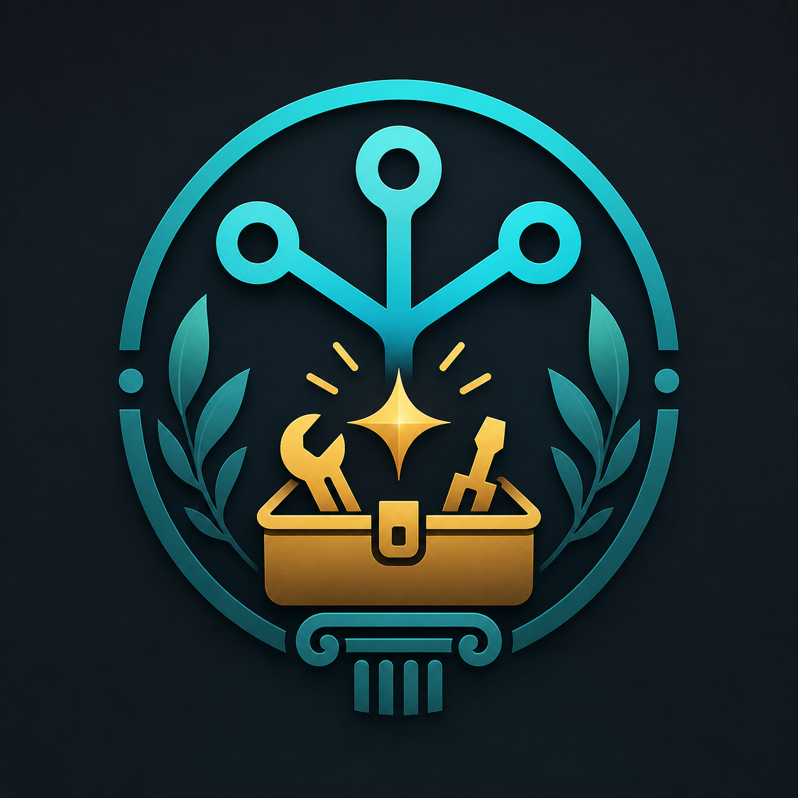

<p align="center">
  
</p>

# Metis

Per-project skill manager for AI coding assistants — Claude Code, Codex, and more. Μῆτις — the Greek Titaness of skill, wisdom, and craft.

## Setup

```bash
git clone https://github.com/ZhongsJie/metis.git ~/Documents/Repository/skills
cd ~/Documents/Repository/skills
npm install

# Add to PATH (prepend so compiled bin takes priority)
echo 'export PATH="$HOME/Documents/Repository/skills/bin:$PATH"' >> ~/.zshrc
source ~/.zshrc
```

## Quick Start

```bash
# Add a git source and scan its skills
metis source add https://github.com/obra/superpowers.git

# Search available skills
metis search pptx

# Initialize a project for metis linking
metis init ~/my-project

# Link skills to your project (interactive checkbox)
metis link -i -t ~/my-project

# List discovered skills
metis list

# See what's linked
metis linked
```

## Commands

| Command | Description |
|---------|-------------|
| `metis init [path]` | Create `.claude/skills/` or `.codex/skills/` in project |
| `metis source add <url>` | Clone a git source and scan its skills |
| `metis source add <url> --name <name>` | Clone with an explicit source name |
| `metis source list` | List configured sources |
| `metis source remove <name>` | Remove a source repository |
| `metis source update <name>` | Pull latest from source repository |
| `metis search <query>` | Search available skills across all sources |
| `metis list` | List discovered skills |
| `metis info <name>` | Show skill details and SKILL.md preview |
| `metis update [name]` | Update source(s) and rescan skills |
| `metis remove [name]` | Remove a skill from the local registry (`-i` for interactive) |
| `metis link [name]` | Link skill to project (`-i` for interactive checkbox) |
| `metis unlink [name]` | Unlink skill from project (`-i` for interactive checkbox) |
| `metis linked [name]` | Show link status for all or specific skill |

## Interactive Mode

Use `-i` for interactive selection with checkbox UI:

```bash
metis remove -i           # pick skills to remove
metis link -i             # pick skills to link (checkbox)
metis unlink -i           # pick skills to unlink (checkbox)
```

- **↑/↓** navigate
- **Space** toggle
- **Enter** confirm
- **Ctrl+C** cancel

Color-coded status indicators:
- `(linked)` in green — already linked
- `(not linked)` in gray — not yet linked

## Options

| Flag | Applies to | Description |
|------|-----------|-------------|
| `-i, --interactive` | remove, link, unlink | Interactive selection mode |
| `-t, --to <path>` | link | Target project path (default: cwd) |
| `-f, --from <path>` | unlink | Source project path (default: cwd) |
| `-f, --force` | source remove, remove | Force removal |
| `-p, --platform <p>` | init, link, unlink | Platform: `claude-code` (default) or `codex` |

## How It Works

```
~/Documents/Repository/
└── skills/                          # This repo (skill manager)
    └── bin/metis                    # CLI entry point

~/.metis/                            # Metis data directory
├── sources.json                     # Configured sources
├── registry.json                    # Discovered skill metadata
└── skills/                          # Cloned git source repositories
    ├── superpowers/
    │   └── skills/
    │       ├── brainstorming/SKILL.md
    │       └── ...
    └── my-single-skill/
        └── SKILL.md

~/my-project/
└── .claude/
    └── skills/
        ├── brainstorming → ~/.metis/skills/superpowers/skills/brainstorming
        └── my-single-skill → ~/.metis/skills/my-single-skill
```

**Sources** are git repositories cloned under `~/.metis/skills/<source>/`. A repository can be a single skill with `SKILL.md` at the root, or a collection with `skills/*/SKILL.md`.

**Skill discovery** runs after `source add` and `source update`, writing metadata to `~/.metis/registry.json`.

**Project linking** requires `metis init` first, then creates a symlink from `<project>/.claude/skills/<name>/` (or `.codex/skills/`) pointing to the skill directory. AI coding assistants discover skills in these directories per-project.

## Development

```bash
npm install
npm run build                  # compile dist/ and bin/metis
npm run dev                    # run CLI via tsx
npm test                       # run unit tests
npm run typecheck              # TypeScript type checking
```

## License

MIT
